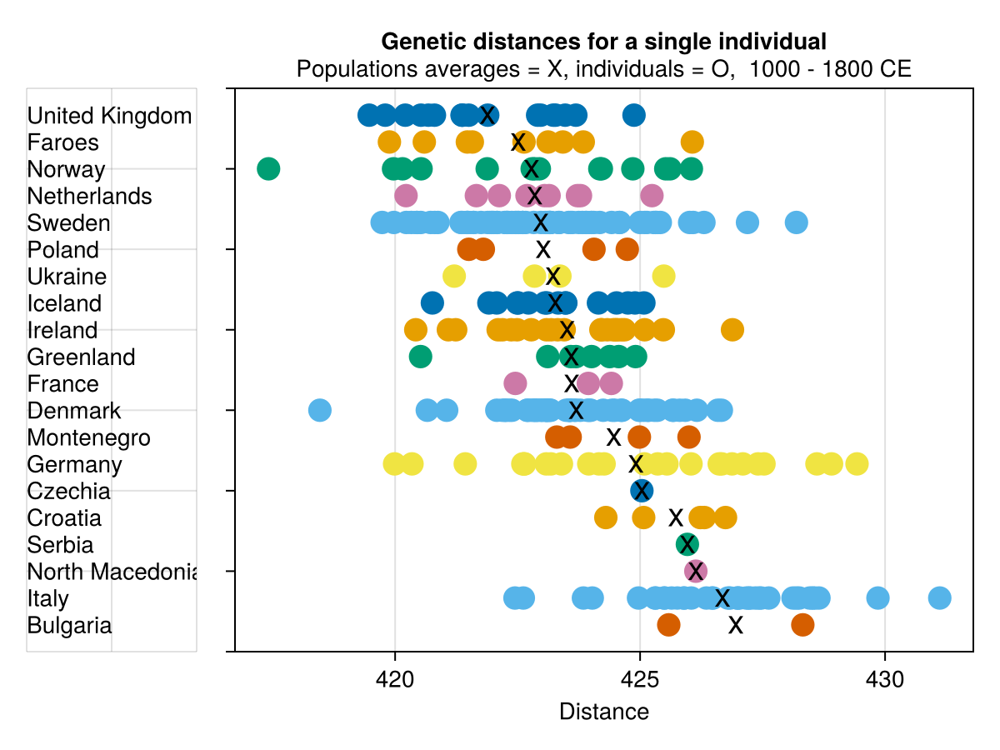
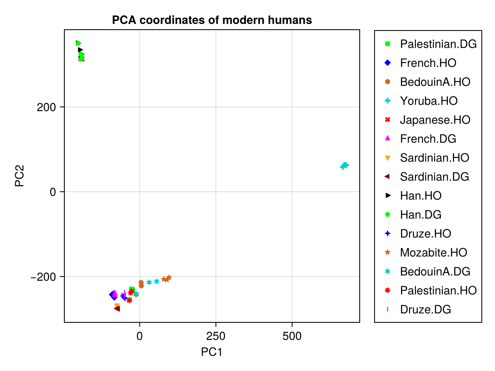

# EigenstratFormat.jl

EigenstratFormat.jl is a library for the [Julia](https://julialang.org/)
programming language to work with the Eigenstrat data format.

The Eigenstrat format is often used in genetics. Its definition
can be found at [David Reich's laboratory](https://reich.hms.harvard.edu/software/InputFileFormats)
and in more detail in the [Eigensoft package](https://github.com/DReichLab/EIG).

## Documentation

- [Current developer version](https://yogischogi.github.io/EigenstratFormat.jl/dev/)

## Examples

A distance plot showing genetic distances of a modern human to different
historical populations.
Example [08_visualization.jl](https://github.com/yogischogi/EigenstratFormat.jl/tree/main/examples/08_visualization.jl)

A PCA plot using modern human DNA samples.
Example [04_pca_nice.jl](https://github.com/yogischogi/EigenstratFormat.jl/blob/main/examples/04_pca_nice.jl)

## Ancient human DNA samples in Eigenstrat format

- [DNA samples](https://reich.hms.harvard.edu/datasets) from single papers at David Reich's laboratory.
- [Allen Ancient DNA Resource (AADR)](https://dataverse.harvard.edu/dataset.xhtml?persistentId=doi:10.7910/DVN/FFIDCW) 

